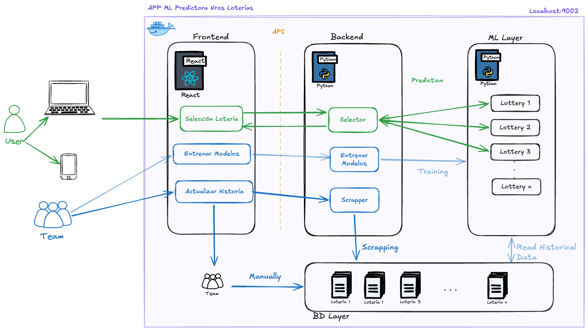

# Proyecto Final App  - ML Junior

## Participantes

- Denis Monsalve Naranjo
- Giovanni Galeano
- Luigi Piedrahita
- Daniel Rios Oquendo
- Ivan Rodriguez
- Andres Hincapie Vasquez
- Pedro Turriago Sanchez
- Jader Andrés Florez López
- Luis Ortiz

## Objetivo General

Desarrollar e implementar modelos de Machine Learning orientados al análisis de series históricas, con el fin de generar combinaciones que cumplan criterios de distribución estadística, optimizando la proporción entre valores pares e impares y la frecuencia de sumas totales dentro de rangos probabilísticamente relevantes.

## Objetivos Específicos

1. Diseñar y entrenar modelos de Machine Learning capaces de identificar patrones, regularidades y comportamientos probabilísticos en series históricas, considerando variables como frecuencia, dispersión y distribución de datos.
2. Establecer e integrar reglas de optimización basadas en principios estadísticos (balance par/impar y rangos de suma total), que permitan validar y mejorar la calidad de las combinaciones generadas por los modelos, asegurando coherencia con tendencias históricas observadas.

## Alcance

Modelos de Machine Learning para analizar series históricas y generar combinaciones que cumplan reglas de oro de distribución estadística. Optimiza balances entre pares e impares y sumas totales frecuentes.

### Restricciones

- El análisis se enfoca exclusivamente en los **números ganadores del premio mayor** de las loterias.
- Se excluyen premios secundarios o categorías de premios menores.
- Los modelos se entrenan y validan únicamente con datos de premios mayores para asegurar la relevancia y calidad de las predicciones.

## Beneficios Esperados

Los beneficios del proyecto se pueden entender en tres niveles:

**Analítico:** Se logra una comprensión más profunda de los patrones subyacentes en los datos históricos. El modelo permite identificar regularidades, frecuencias y comportamientos que no son evidentes mediante análisis tradicionales, lo que incrementa la calidad del análisis estadístico y reduce la dependencia de supuestos intuitivos.

**Operativo:** Se optimiza la generación de combinaciones al incorporar reglas objetivas como el balance entre pares e impares y rangos de suma total frecuentes. Esto permite automatizar procesos que usualmente serían manuales, disminuyendo tiempos de análisis y aumentando la consistencia en los resultados.

**Toma de decisiones:** El proyecto aporta un enfoque basado en datos que mejora la coherencia y trazabilidad de las elecciones realizadas. Las combinaciones generadas no son aleatorias, sino sustentadas en criterios probabilísticos y evidencia histórica, lo que fortalece la justificación técnica del proceso.

Adicionalmente, el modelo es escalable y adaptable, permitiendo su actualización con nuevos datos y su aplicación en contextos similares. Contribuye también a la reducción de sesgos humanos en la selección de combinaciones, promoviendo decisiones más objetivas y alineadas con comportamientos observados en los datos.

## Arquitectura

La aplicación **ML Predictora de Números de Loterias** está estructurada en cuatro capas principales:

### 1. **Frontend (React)**
- Interfaz de usuario responsable de la selección de loterias
- Visualización de resultados y predicciones
- Comunicación con el backend mediante API REST

### 2. **Backend (Python)**
- **Selector:** Componente que gestiona la selección de loterias y coordina las predicciones
- **Entrenar Modelos:** Módulo responsable del entrenamiento de los modelos de ML con datos históricos
- **Scraper:** Utilidad existente para Baloto. No está expuesta como API y no aplica automáticamente a las demás loterias

### 3. **ML Layer (Python)**
- Modelos de Machine Learning especializados para cada loteria
- Análisis de series históricas y generación de predicciones
- Implementación de reglas de optimización estadística (balance par/impar, rangos de suma)

### 4. **BD Layer**
- Almacenamiento de datos históricos por loteria (Loteria 1, Loteria 2, ..., Loteria n)
- Gestión de archivos de datos para lectura y entrenamiento

**Flujos principales:**
- **Predicción:** Usuario → Frontend → Selector → Modelos ML → Resultados
- **Entrenamiento:** Frontend/API → Backend → Entrenar Modelos → ML Layer
- **Datos:** Archivos CSV históricos versionados por loteria. El scraper actual solo cubre Baloto como utilidad independiente



## Stakeholders

- Lina Paola Soto Montes

## Instalación y ejecución local (Docker)

### Requisitos previos

| Herramienta | Versión mínima | Verificar |
|---|---|---|
| Docker Engine | 24+ | `docker --version` |
| docker-compose | 1.29+ | `docker-compose --version` |
| Git | cualquier | `git --version` |

### Pasos

**1. Clonar el repositorio**

```bash
git clone <url-del-repositorio>
cd proyecto_final
```

**2. Configurar variables de entorno**

```bash
cp .env.example .env
```

El archivo `.env` contiene los valores por defecto para desarrollo local:

```
ENV=development
PORT=9002
DATA_DIR=/code/app/bd/historical
```

> `ENV=development` habilita Swagger UI en `http://localhost:9002/docs`.

**3. Construir y levantar el contenedor**

```bash
docker-compose up -d --build
```

El primer build puede tardar 2–5 minutos mientras descarga la imagen base e instala dependencias ML (pandas, numpy, scikit-learn).

**4. Verificar que la app está corriendo**

```bash
curl http://localhost:9002/health
# Respuesta esperada: {"status":"ok","version":"1.0.0"}
```

También puedes acceder a la documentación interactiva en:
`http://localhost:9002/docs`

**5. Detener el contenedor**

```bash
docker-compose down
```

### Ejecución de tests (fuera de Docker)

Requiere Python 3.11+ y el entorno virtual activado:

```bash
# Crear entorno virtual (primera vez)
python3 -m venv .venv
source .venv/bin/activate          # macOS / Linux
# .venv\Scripts\activate           # Windows

# Instalar dependencias de desarrollo
pip install -r requirements-dev.txt

# Correr todos los tests
pytest

# Solo tests unitarios (rápidos)
pytest -m unit

# Solo tests de integración
pytest -m integration

# Ver cobertura detallada
pytest --cov=app --cov-report=html
open htmlcov/index.html
```

---

## API Reference

Base URL: `http://localhost:9002`

El contrato detallado de endpoints, payloads, respuestas y errores está en
[docs/api-spec.md](./docs/api-spec.md). Ese archivo es la fuente de verdad para
la API; el README solo mantiene este resumen para orientación rápida.

Endpoints actuales:

| Método | Ruta | Uso |
|---|---|---|
| `GET` | `/health` | Healthcheck del servicio |
| `GET` | `/api/lotteries` | Lista las loterias registradas |
| `POST` | `/api/predict` | Genera una predicción para una loteria |
| `POST` | `/api/train` | Encola entrenamiento del modelo |
| `GET` | `/api/train/{job_id}/status` | Consulta el estado del entrenamiento |

> Swagger UI está disponible en `/docs` cuando `ENV=development`.

---

## Agregar una nueva lotería

Esta sección documenta el contrato que debe cumplir cualquier desarrollador que quiera integrar una nueva lotería al sistema actual. Agregar una lotería nueva requiere crear el modelo, registrar la clase en la configuración central y declarar el formato de predicción que la API debe normalizar.

### Pasos obligatorios

#### 1. Crear el archivo de datos históricos

Los datos deben estar en formato CSV dentro de la carpeta:

```
app/bd/historical/<id_loteria>/<id_loteria>_historico.csv
```

**Ejemplo para una lotería ficticia `medellin`:**

```
app/bd/historical/medellin/medellin_historico.csv
```

El archivo CSV debe contener al menos las columnas que el modelo va a consumir. Para loterías de 4 cifras + serie, la estructura mínima es:

| Columna | Tipo | Descripción |
|---|---|---|
| `Tipo de Premio` | string | Filtro para quedarse solo con `"Mayor"` |
| `Numero billete ganador` | integer | Número ganador del premio mayor |
| `Numero serie ganadora` | integer | Serie ganadora (0–999) |

> Las columnas adicionales son ignoradas por el modelo. Solo se usan las que el modelo explícitamente lee en `load_data()`.

---

#### 2. Implementar el modelo ML

Crear el archivo:

```
app/ml/<id_loteria>/<id_loteria>_ml.py
```

La clase **debe** heredar de `BaseModel` e implementar los tres métodos abstractos:

```python
# app/ml/medellin/medellin_ml.py

import os
import numpy as np
import pandas as pd
from app.ml.base_model import BaseModel

_DEFAULT_DATA_PATH = os.path.join(
    os.path.dirname(__file__),
    "..", "..", "bd", "historical",
    "medellin", "medellin_historico.csv",
)


class MedellinModel(BaseModel):

    def __init__(self, data_path: str | None = None) -> None:
        self.data_path: str = data_path or os.path.normpath(_DEFAULT_DATA_PATH)
        self.df = None
        # ... atributos del modelo entrenado

    def load_data(self) -> None:
        """Carga y filtra el CSV de datos históricos."""
        if not os.path.exists(self.data_path):
            raise FileNotFoundError(f"Archivo no encontrado: {self.data_path}")
        df = pd.read_csv(self.data_path)
        self.df = df[df["Tipo de Premio"] == "Mayor"].copy()

    def train(self) -> None:
        """Entrena el modelo con los datos cargados."""
        if self.df is None:
            raise RuntimeError("Debe llamar a load_data() antes de train()")
        # ... lógica de entrenamiento

    def predict(self, seed: int | None = None) -> list[int]:
        """Genera una predicción.

        Returns:
            list[int]: Los valores predichos. El contrato de retorno depende
            del tipo de lotería (ver tabla de contratos más abajo).
        """
        if self.df is None:
            raise RuntimeError("Debe llamar a train() antes de predict()")
        # ... lógica de predicción
        return [...]
```

**Contrato del método `predict()` soportado por la API actual:**

El endpoint `POST /api/predict` normaliza la lista retornada por el modelo según la entrada configurada en `LOTTERY_PREDICTION_FORMATS`:

| Tipo de lotería | Ejemplo | Retorno esperado de `predict()` |
|---|---|---|
| 4 cifras + serie | Cundinamarca | `[miles, centenas, decenas, unidades, serie]` |
| 5 números + especial | Baloto | `[n1, n2, n3, n4, n5, superbalota]` |

> **Regla de oro:** En loterías de 4 cifras, los ceros a la izquierda **nunca** se combinan en un entero. El número `0471` se retorna como `[0, 4, 7, 1]`, no como `471`. La API aplica el formato final (zero-padding, strings) antes de enviar al frontend.
>
> Loterías con otra estructura requieren una entrada en `LOTTERY_PREDICTION_FORMATS` antes de exponerlas por la API. Baloto ya tiene formato configurado: 5 números principales + superbalota, sin serie.

---

#### 3. Registrar la clase en el REGISTRY

Abrir `app/config/registry.py` y añadir la nueva lotería:

```python
# app/config/registry.py

from app.ml.base_model import BaseModel
from app.ml.cundinamarca.cundinamarca_ml import CundinamarcaModel
from app.ml.medellin.medellin_ml import MedellinModel          # ← nueva línea

REGISTRY: dict[str, type[BaseModel]] = {
    "cundinamarca": CundinamarcaModel,
    "medellin":     MedellinModel,                             # ← nueva línea
}
```

> El `id` usado como clave del diccionario (`"medellin"`) es el mismo que el frontend enviará en el campo `lottery` de cada request. Debe ser un slug en minúsculas sin espacios ni tildes.

---

#### 4. Registrar el nombre para mostrar

Abrir `app/config/__init__.py` y añadir el nombre legible al diccionario de display names:

```python
LOTTERY_DISPLAY_NAMES: dict[str, str] = {
    "cundinamarca": "Lotería de Cundinamarca",
    "medellin":     "Lotería de Medellín",    # ← nueva línea
}
```

> Si el `id` no está en este diccionario, el endpoint `GET /api/lotteries` mostrará el id capitalizado como nombre. Siempre es preferible registrarlo explícitamente.

---

### Verificación

Después de los cuatro pasos, verificar que todo funciona:

```bash
# 1. La lotería aparece en el listado
curl http://localhost:9002/api/lotteries

# 2. La predicción responde correctamente
curl -X POST http://localhost:9002/api/predict \
  -H "Content-Type: application/json" \
  -d '{"lottery": "medellin"}'

# 3. Los tests pasan
pytest -m unit
pytest -m integration
```

---

### Checklist de nueva lotería

- [ ] CSV en `app/bd/historical/<id>/<id>_historico.csv`
- [ ] Clase en `app/ml/<id>/<id>_ml.py` que hereda `BaseModel`
- [ ] Métodos `load_data()`, `train()`, `predict()` implementados
- [ ] `predict()` retorna lista de enteros según el contrato del tipo de lotería
- [ ] Clase registrada en `REGISTRY` de `app/config/registry.py`
- [ ] Nombre de display registrado en `LOTTERY_DISPLAY_NAMES` de `app/config/__init__.py`
- [ ] Tests unitarios escritos para la nueva clase (mínimo: `load_data`, `train`, `predict`)
- [ ] Si la lotería no es de 4 cifras + serie, registrar su formato en `LOTTERY_PREDICTION_FORMATS` y documentar el contrato
- [ ] `pytest` pasa al 100% sin errores

---

## Referencias

- [Definición del Proyecto en Miro](https://miro.com/app/board/uXjVHec2Ol0=/?moveToWidget=3458764668982159419&cot=14)
